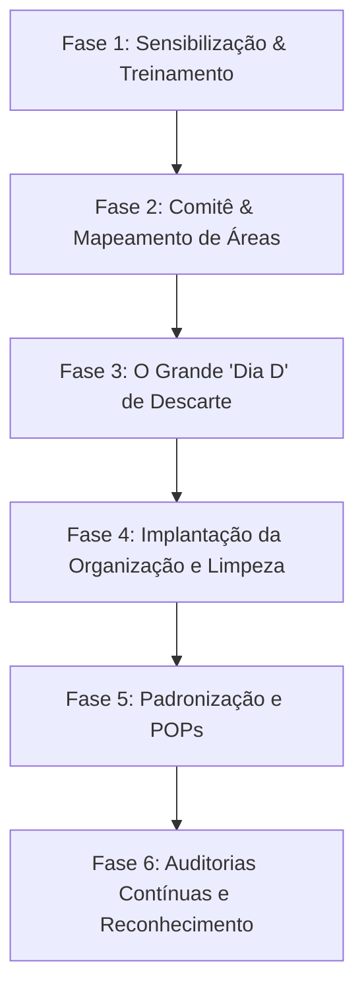

# MANUAL CORPORATIVO DE IMPLANTAÇÃO DO PROGRAMA 5S E FERRAMENTAS DA QUALIDADE

**Empresa / Unidade:** Gestão da Qualidade & Operações  
**Versão:** 1.0  
**Data:** 2026  
**Normas de Referência:** ABNT NBR ISO 9001:2015, NBR ISO 19011:2018, Diretrizes Lean Manufacturing

---

## SUMÁRIO

1. [Introdução e Filosofia 5S](#1-introdução-e-filosofia-5s)
2. [Estrutura Organizacional e Papéis](#2-estrutura-organizacional-e-papéis)
3. [Cronograma e Etapas de Implantação](#3-cronograma-e-etapas-de-implantação)
4. [Detalhamento Prático dos 5 Sensos](#4-detalhamento-prático-dos-5-sensos)
   - [4.1. SEIRI - Senso de Utilização / Descarte](#41-seiri---senso-de-utilização--descarte)
   - [4.2. SEITON - Senso de Organização](#42-seiton---senso-de-organização)
   - [4.3. SEISO - Senso de Limpeza](#43-seiso---senso-de-limpeza)
   - [4.4. SEIKETSU - Senso de Padronização e Saúde](#44-seiketsu---senso-de-padronização-e-saúde)
   - [4.5. SHITSUKE - Senso de Disciplina e Autodisciplina](#45-shitsuke---senso-de-disciplina-e-autodisciplina)
5. [Sistemática de Auditoria e Escala de Avaliação](#5-sistemática-de-auditoria-e-escala-de-avaliação)
6. [Integração com Ferramentas da Qualidade](#6-integração-com-ferramentas-da-qualidade)
   - [6.1. Ciclo PDCA](#61-ciclo-pdca)
   - [6.2. Diagrama de Ishikawa (Espinha de Peixe / 6M)](#62-diagrama-de-ishikawa-espinha-de-peixe--6m)
   - [6.3. Técnica dos 5 Porquês](#63-técnica-dos-5-porquês)
   - [6.4. Matriz GUT (Gravidade, Urgência, Tendência)](#64-matriz-gut-gravidade-urgência-tendência)
   - [6.5. Plano de Ação 5W2H e Quadro Kanban](#65-plano-de-ação-5w2h-e-quadro-kanban)
   - [6.6. Poka-Yoke (Dispositivos À Prova de Erros)](#66-poka-yoke-dispositivos-à-prova-de-erros)
7. [Anexos: Checklists e Formulários Oficiais](#7-anexos-checklists-e-formulários-oficiais)

---

## 1. INTRODUÇÃO E FILOSOFIA 5S

O **Programa 5S** é uma metodologia de origem japonesa voltada para a promoção da organização, limpeza, eficiência e disciplina no ambiente de trabalho. Aplicado tanto em áreas fabris quanto em escritórios e almoxarifados, o 5S é a **base fundamental da Cultura Lean** e dos Sistemas de Gestão da Qualidade (ISO 9001).

### Objetivos do Programa:
- **Redução de Desperdícios:** Eliminação de tempos de busca, excesso de estoque e materiais obsoletos.
- **Aumento da Segurança:** Eliminação de riscos de tropeços, vazamentos, fiação exposta e bloqueio de emergências.
- **Melhoria da Produtividade:** Padronização visual onde cada item tem um local definido e identificado.
- **Engajamento e Clima Organizacional:** Criação de um ambiente agradável, limpo e profissional.

---

## 2. ESTRUTURA ORGANIZACIONAL E PAPÉIS

Para assegurar a perpetuidade do programa, a estrutura deve contar com liderança ativa e responsabilidades bem definidas:

| Papel | Responsabilidades Chave |
| :--- | :--- |
| **Alta Direção / Gerência** | Garantir recursos, participar dos eventos de lançamento e auditorias, reconhecer equipes de destaque. |
| **Comitê Central de 5S** | Planejar treinamentos, elaborar cronogramas de auditoria, consolidar indicadores e coordenar ações. |
| **Líderes de Setor** | Manter o padrão do 5S na sua área (Fábrica, Estoque, Montagem), orientar a equipe diária e sanar pendências. |
| **Auditores Internos de 5S** | Realizar as rondas periódicas de avaliação de forma imparcial, registrando notas e evidências. |
| **Todos os Colaboradores** | Praticar os 5 sensos diariamente na sua bancada, estação de trabalho e áreas comuns. |

---

## 3. CRONOGRAMA E ETAPAS DE IMPLANTAÇÃO

1. **Sensibilização e Capacitação:** Treinamento de 100% dos colaboradores sobre a filosofia 5S.
2. **Mapeamento de Setores:** Divisão da empresa em áreas (ex: Fábrica, Montagem e Testes, Estoque/Almoxarifado, Escritórios).
3. **O "Dia D" de Descarte:** Evento corporativo focado no *Seiri* (separação do necessário do desnecessário e colocação de Cartões Vermelhos).
4. **Organização e Sinalização:** Demarcação de pisos, etiquetagem de prateleiras, organização de cabos e ferramentas.
5. **Padronização:** Formalização dos Procedimentos Operacionais Padrão (POPs) e checklists diários.
6. **Ciclo de Auditorias e Reconhecimento:** Auditorias mensais ou bimestrais com feedback imediato e celebração de resultados.

---

## 4. DETALHAMENTO PRÁTICO DOS 5 SENSOS

### 4.1. SEIRI - Senso de Utilização / Descarte
*Princípio:* Conservar no local apenas o que é estritamente necessário para o trabalho diário.

- **Ações Práticas:**
  - Identificar itens sem uso ou obsoletos (ferramentas quebradas, documentos antigos, caixas vazias).
  - Aplicar o **Cartão Vermelho** para itens duvidosos ou que necessitam de destino (reparo, devolução, descarte ou leilão).
  - Manter armários, prateleiras e bancadas livres de objetos pessoais desnecessários.
  - Armazenar produtos acabados ou de uso esporádico em áreas específicas, fora da bancada de produção.

### 4.2. SEITON - Senso de Organização
*Princípio:* Um lugar para cada coisa, e cada coisa no seu lugar.

- **Ações Práticas:**
  - Demarcação visual de piso (faixas amarelas/brancas) para paletes, carrinhos, lixeiras e paleteiras.
  - Identificação de gavetas, caixas, prateleiras e ferramentas com etiquetas e códigos legíveis.
  - Organização lógica de cabos elétricos e pneumáticos (evitando emaranhados e riscos de tropeço).
  - Sinalização clara e sem obstrução das vias de circulação de pedestres e empilhadeiras.

### 4.3. SEISO - Senso de Limpeza
*Princípio:* Limpar e inspecionar para evitar a sujeira na fonte.

- **Ações Práticas:**
  - Manter equipamentos, computadores, bancadas e ferramentas limpos e conservados.
  - Inspecionar e eliminar vazamentos de água ou vazamentos/perdas de ar comprimido.
  - Manter lixeiras organizadas, limpas e no padrão da Coleta Seletiva.
  - Garantir a limpeza da área de trabalho antes e ao final de cada expediente.
  - Proibir consumo de alimentos nos setores operacionais/fabris.

### 4.4. SEIKETSU - Senso de Padronização e Saúde
*Princípio:* Manter as condições físicas e mentais favoráveis à saúde e à segurança.

- **Ações Práticas:**
  - Padronização de identificação visual (placas, cores, símbolos e sinalizações de advertência).
  - Garantir o uso correto e monitorado de EPIs (Equipamentos de Proteção Individual).
  - Manter extintores, mangueiras e saídas de emergência desobstruídos e com acesso livre.
  - Assegurar ergonomia (cadeiras reguláveis, altura adequada de bancadas, iluminação).
  - Manter máquinas e equipamentos com proteções de segurança em perfeito estado de uso.

### 4.5. SHITSUKE - Senso de Disciplina e Autodisciplina
*Princípio:* Transformar os padrões em hábitos diários sem necessidade de cobrança.

- **Ações Práticas:**
  - Cumprimento espontâneo das normas de segurança, vestuário e procedimentos operacionais.
  - Participação ativa da liderança nas rondas e no incentivo ao 5S.
  - Resolução tempestiva das Não Conformidades apontadas nas auditorias anteriores.
  - Conhecimento e alinhamento com a Política da Qualidade da empresa.

---

## 5. SISTEMÁTICA DE AUDITORIA E ESCALA DE AVALIAÇÃO

### Escala de Pontuação dos Itens:
Cada item auditado é avaliado de **1 a 4 pontos**:

- **1 - INSUFICIENTE (0%):** O padrão não é cumprido; presença visível de não conformidades graves.
- **2 - REGULAR (33%):** Cumprido parcialmente; exige alertas frequentes da liderança.
- **3 - BOM (66%):** Cumprido na maior parte do tempo; pequenos ajustes pendentes.
- **4 - ÓTIMO (100%):** Padrão cumprido com excelência; exemplo de referência.

### Critério de Evolução do Senso:
> **Regra de Transição:** Um setor é considerado aprovado e apto a evoluir para o próximo "S" quando atinge no mínimo **95% da pontuação total** no senso atual.

$$\text{Aproveitamento (\%)} = \left( \frac{\text{Pontuação Obtida}}{\text{Pontuação Máxima Possível}} \right) \times 100$$

---

## 6. INTEGRAÇÃO COM FERRAMENTAS DA QUALIDADE

O 5S não funciona isoladamente; ele se conecta com as ferramentas tradicionais da Qualidade para sanar problemas recorrentes e promover a melhoria contínua.

### 6.1. Ciclo PDCA
- **P (Plan - Planejar):** Mapear setores, definir metas de auditoria e elaborar os checklists 5S.
- **D (Do - Executar):** Realizar o "Dia D", treinar a equipe e implementar sinalizações visuais.
- **C (Check - Checar):** Executar auditorias de 5S, tabular notas e gerar o Gráfico Radar de Maturidade.
- **A (Act - Agir):** Abrir Planos de Ação (5W2H) para corrigir itens com notas insuficientes/regulares.

### 6.2. Diagrama de Ishikawa (Espinha de Peixe / 6M)
Utilizado para investigar desvios graves de 5S ou falhas recorrentes nas auditorias:
1. **Mão de Obra:** Falta de treinamento no 5S, desconhecimento da norma.
2. **Método:** Ausência de Procedimento Operacional Padrão (POP) ou falha na rotina de limpeza.
3. **Máquina:** Equipamento sem manutenção gerando vazamento de óleo/sujeira.
4. **Material:** Excesso de matéria-prima acumulada na bancada sem identificação.
5. **Meio Ambiente:** Iluminação deficiente, falta de sinalização de piso ou desorganização visual.
6. **Medição:** Falta de calibração em instrumentos ou ausência de indicadores de auditoria.

### 6.3. Técnica dos 5 Porquês
Método simples para encontrar a causa raiz de uma não conformidade no 5S:
- *Problema:* Ferramentas elétricas abandonadas no chão da fábrica.
  - *1º Por quê?* Não foram guardadas no armário ao final do turno.
  - *2º Por quê?* O armário de ferramentas estava lotado e trancado.
  - *3º Por quê?* Havia peças velhas e itens obsoletos ocupando o espaço útil do armário.
  - *4º Por quê?* Não foi realizado a triagem (*Seiri*) de materiais sem uso nos últimos 6 meses.
  - *5º Por quê? (Causa Raiz)* Falta de rotina mensal de descarte e auditoria nos armários de ferramentas.

### 6.4. Matriz GUT (Gravidade, Urgência, Tendência)
Ferramenta para priorização de ações corretivas do 5S. Cada variável é pontuada de **1 a 5**:

$$\text{Prioridade (GUT)} = \text{Gravidade (G)} \times \text{Urgência (U)} \times \text{Tendência (T)}$$

- **Gravidade (G):** Impacto do problema no produto, segurança ou ambiente (1 = Mínimo, 5 = Gravíssimo).
- **Urgência (U):** Necessidade de tempo para resolver o problema (1 = Pode aguardar, 5 = Ação imediata).
- **Tendência (T):** Evolução caso nada seja feito (1 = Não piora, 5 = Piora rapidamente).

### 6.5. Plano de Ação 5W2H e Quadro Kanban
Todas as oportunidades de melhoria identificadas nas auditorias 5S devem gerar ações estruturadas:
- **5W:** What (O quê?), Why (Por quê?), Where (Onde?), When (Quando?), Who (Quem?).
- **2H:** How (Como?), How Much (Quanto custa?).

As ações são controladas em um **Quadro Kanban Visual** dividido em três colunas:  
`[ A FAZER ]` $\rightarrow$ `[ EM ANDAMENTO ]` $\rightarrow$ `[ CONCLUÍDO ]`

### 6.6. Poka-Yoke (Dispositivos À Prova de Erros)
Implementação de soluções físicas e visuais para impedir falhas de organização:
- Placas com formatos vazados para encaixe único de ferramentas (Shadowboards).
- Conectores com pinagens exclusivas (impedindo inversão de cabos).
- Lixeiras com tampas coloridas padrão CONAMA para coleta seletiva automática.

---

## 7. ANEXOS: CHECKLISTS E FORMULÁRIOS OFICIAIS

Os formulários operacionais de auditoria para os setores de **Fábrica, Montagem/Testes e Estoque** contêm as 10 perguntas padrão por senso, tabuladas para geração do relatório e gráfico radar de maturidade.

---
*Manual desenvolvido e padronizado em conformidade com as melhores práticas de Gestão da Qualidade.*
