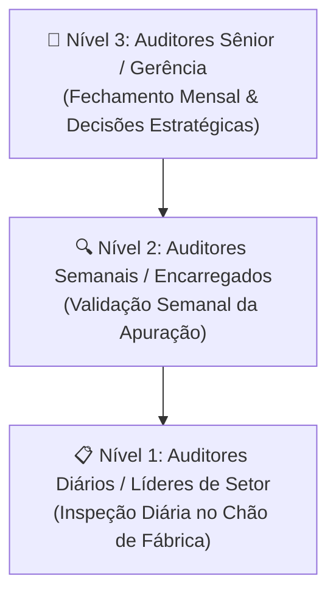
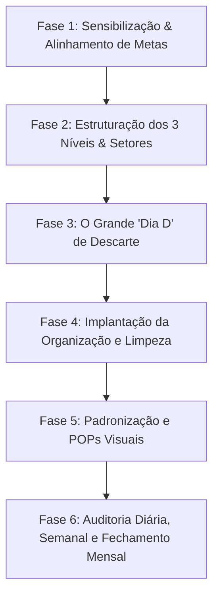

# MANUAL CORPORATIVO DE IMPLANTAÇÃO DO PROGRAMA 5S E GOVERNANÇA DA QUALIDADE

**Empresa / Unidade:** Gestão da Qualidade & Operações  
**Modelo de Implantação:** IMPAK TTO Plásticos de Engenharia  
**Versão:** 2.0 (Arquitetura de Governança 5S em 3 Níveis)  
**Data:** 2026  
**Normas de Referência:** ABNT NBR ISO 9001:2015, NBR ISO 19011:2018, Diretrizes Lean Manufacturing  
**Acesso:** 🔒 Estritamente Restrito à Gerência de Projeto e Diretoria (Auditores Sênior / ADM)

---

## SUMÁRIO

1. [Introdução e Filosofia 5S](#1-introdução-e-filosofia-5s)
2. [Arquitetura de Governança 5S em 3 Níveis](#2-arquitetura-de-governança-5s-em-3-níveis)
3. [Cronograma e Etapas de Implantação do Zero](#3-cronograma-e-etapas-de-implantação-do-zero)
4. [Detalhamento Prático dos 5 Sensos](#4-detalhamento-prático-dos-5-sensos)
   - [4.1. SEIRI - Senso de Utilização / Descarte](#41-seiri---senso-de-utilização--descarte)
   - [4.2. SEITON - Senso de Organização](#42-seiton---senso-de-organização)
   - [4.3. SEISO - Senso de Limpeza](#43-seiso---senso-de-limpeza)
   - [4.4. SEIKETSU - Senso de Padronização e Saúde](#44-seiketsu---senso-de-padronização-e-saúde)
   - [4.5. SHITSUKE - Senso de Disciplina e Autodisciplina](#45-shitsuke---senso-de-disciplina-e-autodisciplina)
5. [Sistemática de Auditoria em 3 Níveis (Bom, Regular, Ruim)](#5-sistemática-de-auditoria-em-3-níveis-bom-regular-ruim)
6. [Quadro da Fábrica: COMO ESTÁ NOSSA ÁREA?](#6-quadro-da-fábrica-como-está-nossa-área)
7. [Integração com Ferramentas da Qualidade](#7-integração-com-ferramentas-da-qualidade)
   - [7.1. Ciclo PDCA](#71-ciclo-pdca)
   - [7.2. Diagrama de Ishikawa (Espinha de Peixe / 6M)](#72-diagrama-de-ishikawa-espinha-de-peixe--6m)
   - [7.3. Técnica dos 5 Porquês](#73-técnica-dos-5-porquês)
   - [7.4. Matriz GUT (Gravidade, Urgência, Tendência)](#74-matriz-gut-gravidade-urgência-tendência)
   - [7.5. Plano de Ação 5W2H e Quadro Kanban](#75-plano-de-ação-5w2h-e-quadro-kanban)
   - [7.6. Poka-Yoke (Dispositivos À Prova de Erros)](#76-poka-yoke-dispositivos-à-prova-de-erros)
8. [Matriz de Setores e Atores Cadastrados](#8-matriz-de-setores-e-atores-cadastrados)

---

## 1. INTRODUÇÃO E FILOSOFIA 5S

O **Programa 5S** é uma metodologia de origem japonesa voltada para a promoção da organização, limpeza, eficiência e disciplina no ambiente de trabalho. Aplicado tanto em áreas fabris quanto em escritórios e almoxarifados, o 5S é a **base fundamental da Cultura Lean** e dos Sistemas de Gestão da Qualidade (ISO 9001).

### Objetivos da Auditoria Criada do Zero:
- **Redução de Desperdícios:** Eliminação de tempos de busca, excesso de estoque e materiais obsoletos.
- **Aumento da Segurança:** Eliminação de riscos de tropeços, vazamentos, fiação exposta e bloqueio de emergências.
- **Melhoria da Produtividade:** Padronização visual onde cada item tem um local definido e identificado.
- **Engajamento e Clima Organizacional:** Criação de um ambiente agradável, limpo e profissional com responsabilidade compartilhada.

---

## 2. ARQUITETURA DE GOVERNANÇA 5S EM 3 NÍVEIS

Para assegurar a perpetuidade e o controle da auditoria criada do zero, o sistema funciona com uma **estrutura em 3 Níveis de Inspeção e Validação**:

| Nível de Auditoria | Atores Chave | Periodicidade | Responsabilidades Chave |
| :--- | :--- | :--- | :--- |
| **Nível 1: Auditores Diários** | Líderes de Setor (Alexandre, Marcos, Bruno, Elton, Giovanna, Fabio, Andre) | Diária (Seg a Sáb) | Manter o padrão do 5S na sua área, preencher o checklist de campo e atualizar o Quadro *"COMO ESTÁ NOSSA ÁREA?"*. |
| **Nível 2: Auditores Semanais** | Encarregados de Fábrica e RH (Diego e Filipe) | Semanal | Auditar e validar o que foi apurado pelos Líderes Diários, verificando a consistência dos lançamentos. |
| **Nível 3: Auditores Sênior** | Gerente de Projeto (Alexandre Souza) e Diretoria (Kaio) | Mensal / Executivo | Fechamento mensal com consolidação de médias, análise do gráfico radar de maturidade, Matriz GUT, Kanban e **Acesso Restrito ao Manual**. |

---

## 3. CRONOGRAMA E ETAPAS DE IMPLANTAÇÃO DO ZERO

1. **Sensibilização e Alinhamento:** Capacitação de 100% dos líderes e colaboradores sobre a filosofia 5S.
2. **Mapeamento e Atribuição de Setores:** Definição clara das áreas (Usinagem, Holter, Armários, Portas/Cortinas, Acabamento, Comercial).
3. **O "Dia D" de Descarte:** Evento corporativo focado no *Seiri* (separação do necessário do desnecessário com aplicação de Cartões Vermelhos).
4. **Organização e Sinalização:** Demarcação de pisos, etiquetagem de prateleiras, organização de cabos e painéis sombra (*Shadowboards*).
5. **Padronização:** Formalização dos Procedimentos Operacionais Padrão (POPs) e checklists de campo.
6. **Ciclo Operacional de Auditorias:** Rotina diária dos líderes, validação semanal dos encarregados e fechamento mensal da diretoria.

---

## 4. DETALHAMENTO PRÁTICO DOS 5 SENSOS

### 4.1. SEIRI - Senso de Utilização / Descarte
*Princípio:* Separar o útil do inútil • Descarte de desnecessários.
- **Ações Práticas:**
  - Identificar itens sem uso ou obsoletos (ferramentas quebradas, documentos antigos, caixas vazias).
  - Aplicar o **Cartão Vermelho** para itens duvidosos ou que necessitam de destino (reparo, devolução, descarte ou leilão).
  - Manter armários, prateleiras e bancadas livres de objetos pessoais desnecessários.

### 4.2. SEITON - Senso de Organização
*Princípio:* Um lugar para cada coisa, e cada coisa no seu lugar • Identificação visual.
- **Ações Práticas:**
  - Demarcação visual de piso (faixas amarelas/brancas) para paletes, carrinhos, lixeiras e paleteiras.
  - Identificação de gavetas, caixas, prateleiras e ferramentas com etiquetas e códigos legíveis.
  - Organização lógica de cabos elétricos e pneumáticos.

### 4.3. SEISO - Senso de Limpeza
*Princípio:* Manter o setor limpo • Inspecionar e conservar.
- **Ações Práticas:**
  - Manter equipamentos, computadores, bancadas e ferramentas limpos e conservados.
  - Inspecionar e eliminar vazamentos de água ou vazamentos/perdas de ar comprimido.
  - Manter lixeiras organizadas, limpas e no padrão da Coleta Seletiva.

### 4.4. SEIKETSU - Senso de Padronização e Saúde
*Princípio:* Manter padrões • Saúde, higiene e segurança.
- **Ações Práticas:**
  - Padronização de identificação visual (placas, cores, símbolos e sinalizações de advertência).
  - Garantir o uso correto e monitorado de EPIs (Equipamentos de Proteção Individual).
  - Manter extintores, mangueiras e saídas de emergência desobstruídos.

### 4.5. SHITSUKE - Senso de Disciplina e Autodisciplina
*Princípio:* Seguir regras • Cultivar hábitos diariamente.
- **Ações Práticas:**
  - Cumprimento espontâneo das normas de segurança, vestuário e procedimentos operacionais.
  - Participação ativa da liderança nas rondas e no incentivo ao 5S.
  - Resolução tempestiva das Não Conformidades apontadas nas auditorias anteriores.

---

## 5. SISTEMÁTICA DE AUDITORIA EM 3 NÍVEIS (BOM, REGULAR, RUIM)

Para facilitar a compreensão dos inspetores de fábrica e manter a máxima agilidade operacional, a pontuação dos 50 itens oficiais da auditoria utiliza a **Escala Simplificada de 3 Níveis**:

| Avaliação | Cor & Ícone | Pontuação Equivalente | Percentual de Conformidade | Significado Operacional |
| :--- | :---: | :---: | :---: | :--- |
| **BOM** | 🟢 | 3 PONTOS | 100% | Padrão totalmente cumprido com excelência. |
| **REGULAR** | 🟡 | 2 PONTOS | 50% | Cumprido parcialmente; necessita de ajuste rápido. |
| **RUIM** | 🔴 | 1 PONTO | 0% | Padrão não cumprido; presença de não conformidade. |

### Cálculo do Índice de Maturidade 5S:
$$\text{Índice de Maturidade (\%)} = \left( \frac{\text{Pontuação Obtida}}{\text{Pontuação Máxima (150 pts)}} \right) \times 100$$

---

## 6. QUADRO DA FÁBRICA: COMO ESTÁ NOSSA ÁREA?

O **Quadro da Fábrica** é o painel de gestão visual presente no chão de fábrica, onde a avaliação diária (Segunda a Sábado) é atualizada com 1 clique:

- 🟢 **Bom:** Área limpa, organizada e padronizada.
- 🟡 **Regular:** Pequenos desvios observados no turno.
- 🔴 **Ruim:** Pendência crítica a ser corrigida pela liderança.

---

## 7. INTEGRAÇÃO COM FERRAMENTAS DA QUALIDADE

### 7.1. Ciclo PDCA
- **P (Planejar):** Mapear setores, cadastrar os 3 níveis de auditores e definir os checklists.
- **D (Executar):** Realizar inspeção diária nos setores e registrar avaliações.
- **C (Checar):** Auditoria semanal de validação e consolidação do Gráfico Radar de Maturidade.
- **A (Agir):** Abrir Planos de Ação (5W2H) e priorização pela Matriz GUT.

### 7.2. Diagrama de Ishikawa (Espinha de Peixe / 6M)
Utilizado pelo Nível 3 (ADM) para investigar causas raízes de desvios no 5S através das 6 categorias: Mão de Obra, Método, Máquina, Material, Meio Ambiente e Medição.

### 7.3. Matriz GUT (Gravidade, Urgência, Tendência)
Priorização matemática de problemas 5S calculada por:
$$\text{Pontuação GUT} = \text{Gravidade (1-5)} \times \text{Urgência (1-5)} \times \text{Tendência (1-5)}$$

### 7.4. Plano de Ação 5W2H e Quadro Kanban
Ações corretivas vinculadas aos setores e acompanhadas nas colunas:
`[ A FAZER ]` $\rightarrow$ `[ EM ANDAMENTO ]` $\rightarrow$ `[ CONCLUÍDO ]`

---

## 8. MATRIZ DE SETORES E ATORES CADASTRADOS (IMPAK TTO)

| Setor da Empresa | Líder Diário (Nível 1) | Auditor Semanal (Nível 2) | Auditor Sênior (Nível 3) |
| :--- | :--- | :--- | :--- |
| **Usinagem** | Alexandre | Diego / Filipe | Alexandre Souza / Kaio |
| **Holter** | Marcos | Diego / Filipe | Alexandre Souza / Kaio |
| **Armários** | Bruno | Diego / Filipe | Alexandre Souza / Kaio |
| **Portas / Cortinas** | Elton | Diego / Filipe | Alexandre Souza / Kaio |
| **Acabamento** | Giovanna | Diego / Filipe | Alexandre Souza / Kaio |
| **Comercial Usinados** | Fabio | Diego / Filipe | Alexandre Souza / Kaio |
| **Comercial Portas/Armários/Cortinas** | Andre | Diego / Filipe | Alexandre Souza / Kaio |

---

*Manual Corporativo de Implantação e Governança 5S — Desenvolvido em conformidade com as normas ABNT NBR ISO 9001:2015 e NBR ISO 19011:2018.*
